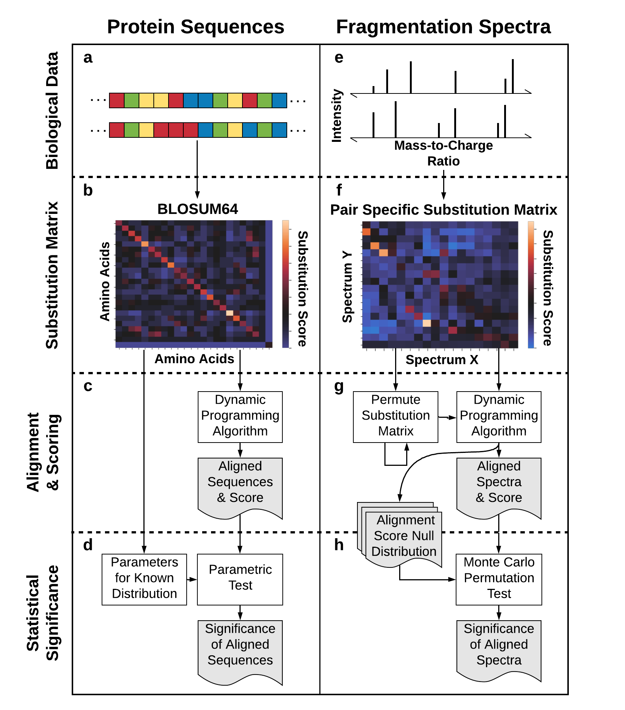

# SIMILE

SIMILE (Significant Interrelation of MS/MS Ions via Laplacian Embedding) is a Python library for pairwise alignment of fragmentation spectra with significance estimation and is robust to multiple differences in chemical structure.
[bioRxiv preprint](https://www.biorxiv.org/content/10.1101/2021.02.24.432767v1)

### New in V2:
- Substitution matrices are now officially similarity matrices because they are now always symmetric
- Precursor-based neutral loss difference counts can be used in addition to the original MZ difference counts
- Maximum weight matching is available in addition to the original monotonic alignment method



## Features
- Generate ~~substitution~~ similarity matrices interrelating fragment ions and neutral losses in fragmention spectra  
(Just like how substitution matrices interrelate amino acids in protein sequences!)

- Align/match and score fragmentation spectra according to the ~~substitutability~~ similarity of their fragment ions and neutral losses

- Calculate the significance of aligned/matched fragmentation spectra

- BONUS: Less than ~~200~~ 230 lines of intelligible code!

## Installation

Use the package manager [conda](https://docs.conda.io/projects/conda/en/latest/user-guide/index.html) to install environment-base.yml for minimum requirements. Alternatively, use environment.yml to run the example notebook.

```bash
conda env create -f environment-base.yml
```

[](https://mybinder.org/v2/gh/biorack/simile/HEAD)

## Python dependencies
- python3 (pinned to 3.7 currently due to non-SIMILE bugs)
- sortedcollections
- numpy
- scipy

## Usage

```python
import simile as sml

# Generate pair-specific similarity matrix
S = sml.similarity_matrix(mzs1, mzs2, pmz1, pmz2, tolerance=.01)

# Align/match and score using upper-right quadrant of substitution matrix
align_score, alignment = sml.pairwise_align(S[:len(mzs1),len(mzs1):])
match_score, matches = sml.pairwise_match(S[:len(mzs1),len(mzs1):])

# Calculate significance of the alignment/matches
align_pval = sml.significance_test(S, mzs1, mzs2, pmz1, pmz2, kind='align')
match_pval = sml.significance_test(S, mzs1, mzs2, pmz1, pmz2, kind='match')


```

## Contributing
Pull requests are welcome.

For major changes, please open an issue first to discuss what you would like to change.

## License
[Modified BSD](https://github.com/biorack/simile/blob/main/license.txt)

## Acknowledgements
The development of SIMILE was made possible by:
* [The U.S. Department of Energy Biological and Environmental Research Program](https://science.energy.gov/ber/)
* [Lawrence Berkeley National Laboratory](http://www.lbl.gov/)
* [The Joint Genome Institute](https://jgi.doe.gov/)
* [The National Energy Research Scientific Computing Center](http://www.nersc.gov/)
